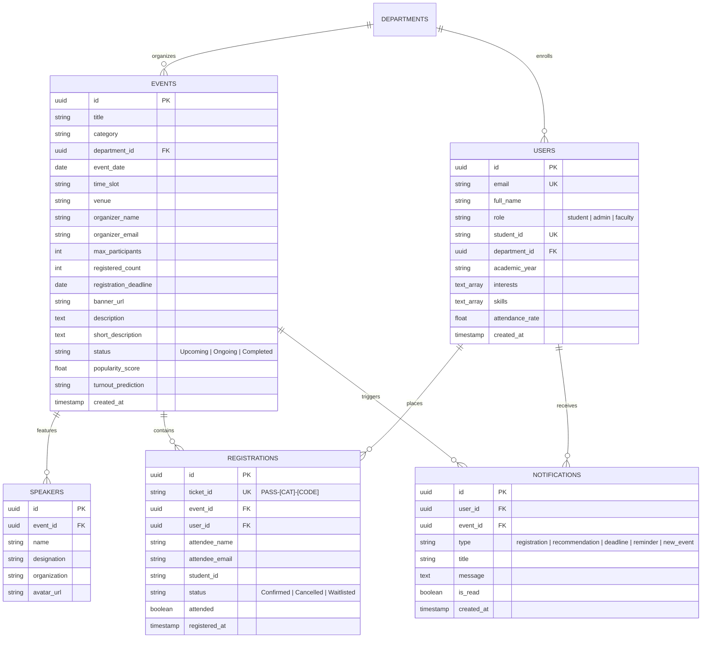

# CampusAI – AI-Based College Event Management System

> **“One Campus. Every Event. Smarter with AI.”**

[](https://srivarshanbala887-hash.github.io/Srivarshan/)
[](./FINAL_PROJECT_COMPLETION_REPORT_100_PERCENT.md)
[](./PROJECT_COMPLETION_REPORT_30_PERCENT.md)
[](./TESTING_AND_ERROR_BOUNDARIES.md)

---

## 📌 Quick Access Links

* 🌐 **Live Deployed Web Application:** [https://srivarshanbala887-hash.github.io/Srivarshan/](https://srivarshanbala887-hash.github.io/Srivarshan/)
* 🏆 **100% Final Review Project Completion Report:** [FINAL_PROJECT_COMPLETION_REPORT_100_PERCENT.md](./FINAL_PROJECT_COMPLETION_REPORT_100_PERCENT.md)
* 📄 **30% Milestone Theoretical Project Report:** [PROJECT_COMPLETION_REPORT_30_PERCENT.md](./PROJECT_COMPLETION_REPORT_30_PERCENT.md)
* 🧪 **Unit Testing & Error Boundaries Architecture:** [TESTING_AND_ERROR_BOUNDARIES.md](./TESTING_AND_ERROR_BOUNDARIES.md)

---

## 📖 Executive Summary

**CampusAI** is an enterprise-grade, responsive collegiate event management platform built using **React 18**, **Vite**, and **Tailwind CSS**. It provides a single centralized hub for students, faculty organizers, and academic administrators to coordinate the entire lifecycle of campus activities—including technical hackathons, coding tournaments, guest seminars, placement bootcamps, and inter-collegiate cultural fests.

The platform distinguishes itself through an autonomous **AI Recommendation Engine** that computes multi-attribute similarity matches between student skills and event prerequisites, paired with **Predictive Turnout Forecasting**, **Cryptographic QR Ticketing**, and an **Admin Intelligence Suite**.

---

## 🌟 Key Functional Pillars

### 🎓 1. Student Experience & Discovery
* **Smart Multi-Faceted Filtering**: Search and filter by 8 categories (*Workshop, Hackathon, Seminar, Coding Competition, Cultural Event, Sports, Placement Training, Club Activity*), departments, date horizons, and seat availability.
* **Personalized AI Recommendations**: Highlights *"AI Recommended For You"* with transparent reasoning tags (e.g. *“Because you are interested in AI and Coding, and from Computer Science & Engineering department”*) and match metrics (e.g. `98% Match`).
* **Real-Time Interest Tuner**: Interactive slider widget allowing students to modify their technical interests dynamically and watch recommendation percentages recalculate on-the-fly.
* **Paperless QR Ticket Passes**: High-resolution mobile digital passes with deterministic ticket hashing (e.g. `PASS-HAC-8492`), pass download, and printable views.
* **Student Pass Wallet ("My Events")**: Manage active, upcoming, and past registrations with 1-click registration cancellation and verified Certificate of Participation generation.

### 🏛️ 2. Institutional Administration & Governance
* **Admin Intelligence Dashboard**: Real-time metric counters for total events, students, registrations, and capacity ratios.
* **Interactive Visual Analytics**: Capacity utilization progress gauges, departmental curriculum balance charts, and monthly registration growth trajectories.
* **Event Lifecycle Management**: Full CRUD operations with instant reactive updates across discovery and admin tables.
* **AI Event Copy & Agenda Generator**: Integrated assistant that auto-generates professional event copy, rules, and schedules from a title and category.
* **Participant Roster & Check-In**: Searchable attendee table, instant attendance check-in toggle (*Present / Absent*), and CSV roster export.

---

## 🗄️ Relational Database Schema & Data Dictionary

For institutional production deployment, CampusAI is architected around a **Third Normal Form (3NF)** relational database schema (implemented in PostgreSQL/MySQL, modeled via Prisma / TypeORM):



### Table Specifications & Constraints

#### 1. `users` Table
| Field Name | Type | Constraints | Description |
| :--- | :--- | :--- | :--- |
| `id` | `UUID` | `PRIMARY KEY, DEFAULT gen_random_uuid()` | Internal unique user ID |
| `email` | `VARCHAR(255)` | `UNIQUE, NOT NULL` | University email address |
| `full_name` | `VARCHAR(150)` | `NOT NULL` | Student or administrator name |
| `role` | `ENUM` | `('student', 'admin', 'faculty'), DEFAULT 'student'` | Access privilege level |
| `student_id` | `VARCHAR(50)` | `UNIQUE, NULLABLE` | Official campus roll/registration number |
| `department` | `VARCHAR(100)` | `NOT NULL` | Academic major / departmental affiliation |
| `skills` | `TEXT[]` | `DEFAULT '{}'` | Array of technical competencies |
| `interests` | `TEXT[]` | `DEFAULT '{}'` | Vector tags for AI matching heuristics |

#### 2. `events` Table
| Field Name | Type | Constraints | Description |
| :--- | :--- | :--- | :--- |
| `id` | `VARCHAR(50)` | `PRIMARY KEY` | Alphanumeric event slug (`evt-101`) |
| `title` | `VARCHAR(255)` | `NOT NULL` | Official event title |
| `category` | `ENUM` | `NOT NULL` | Workshop, Hackathon, Seminar, etc. |
| `department` | `VARCHAR(100)` | `NOT NULL` | Organizing academic department |
| `event_date` | `DATE` | `NOT NULL` | Scheduled date of occurrence |
| `time_slot` | `VARCHAR(100)` | `NOT NULL` | Timing span (e.g., 09:00 AM - 05:00 PM) |
| `venue` | `VARCHAR(200)` | `NOT NULL` | Campus hall, room, or amphitheatre |
| `max_participants`| `INTEGER` | `NOT NULL, CHECK (max_participants > 0)` | Venue seating quota |
| `registered_count`| `INTEGER` | `DEFAULT 0, CHECK (registered_count <= max_participants)` | Current confirmed attendees |
| `status` | `ENUM` | `('Upcoming', 'Ongoing', 'Completed')` | Event lifecycle state |

#### 3. `registrations` Table
| Field Name | Type | Constraints | Description |
| :--- | :--- | :--- | :--- |
| `id` | `UUID` | `PRIMARY KEY, DEFAULT gen_random_uuid()` | Transaction row identifier |
| `ticket_id` | `VARCHAR(50)` | `UNIQUE, NOT NULL` | Digital pass code (`PASS-HAC-8492`) |
| `event_id` | `VARCHAR(50)` | `FOREIGN KEY REFERENCES events(id)` | Associated event |
| `user_id` | `UUID` | `FOREIGN KEY REFERENCES users(id)` | Registering student |
| `status` | `VARCHAR(30)` | `DEFAULT 'Confirmed'` | Registration status |
| `attended` | `BOOLEAN` | `DEFAULT FALSE` | Real-time physical check-in indicator |
| `registered_at` | `TIMESTAMP` | `DEFAULT CURRENT_TIMESTAMP` | Audit registration timestamp |

---

## 📡 RESTful API Specifications

The production backend architecture exposes a modular, versioned REST API (`/api/v1`) secured via **JWT Bearer Authentication**.

### Base URL
```
https://campusai.edu/api/v1
```

---

### 1. Authentication Endpoints

#### `POST /auth/login`
Authenticates student or administrator credentials and returns a signed JWT.
* **Headers**: `Content-Type: application/json`
* **Request Body**:
  ```json
  {
    "email": "alex.johnson@campus.edu",
    "password": "SecurePassword123!"
  }
  ```
* **Success Response (`200 OK`)**:
  ```json
  {
    "status": "success",
    "data": {
      "token": "eyJhbGciOiJIUzI1NiIsInR5cCI6IkpXVCJ9...",
      "user": {
        "id": "usr-std-01",
        "name": "Alex Johnson",
        "role": "student",
        "department": "Computer Science & Engineering"
      }
    }
  }
  ```

---

### 2. Events Endpoints

#### `GET /events`
Retrieves a paginated catalog of campus events with multi-faceted filtering.
* **Query Parameters**:
  * `search` *(string)*: Full-text search term
  * `category` *(string)*: e.g. `Hackathon`, `Workshop`
  * `department` *(string)*: Organizing department
  * `status` *(string)*: `Upcoming` | `Completed`
  * `sortBy` *(string)*: `ai_match` | `date_asc` | `popularity`
* **Success Response (`200 OK`)**:
  ```json
  {
    "status": "success",
    "results": 12,
    "data": [
      {
        "id": "evt-101",
        "title": "HackNova 2026: AI & Web3 National Hackathon",
        "category": "Hackathon",
        "department": "Computer Science & Engineering",
        "date": "2026-10-15",
        "venue": "Campus Innovation Center, Hall A",
        "maxParticipants": 250,
        "registeredCount": 218,
        "status": "Upcoming",
        "aiMatchScore": 98
      }
    ]
  }
  ```

#### `POST /events`
Publishes a new collegiate event (Requires `admin` or `faculty` role).
* **Headers**: `Authorization: Bearer <TOKEN>`, `Content-Type: application/json`
* **Request Body**:
  ```json
  {
    "title": "NextGen AI & Cloud Summit",
    "category": "Workshop",
    "department": "Computer Science & Engineering",
    "date": "2026-11-05",
    "time": "10:00 AM - 04:00 PM",
    "venue": "Turing Lab 1",
    "maxParticipants": 120,
    "registrationDeadline": "2026-11-03",
    "shortDescription": "Hands-on deep dive into LLM deployment.",
    "description": "Comprehensive practical workshop covering RAG and LangChain."
  }
  ```
* **Success Response (`201 Created`)**: Returns created event record.

---

### 3. Registration & Ticketing Endpoints

#### `POST /events/:id/register`
Reserves a verified seat and generates an authenticated digital QR pass.
* **Headers**: `Authorization: Bearer <TOKEN>`
* **Request Body**:
  ```json
  {
    "studentName": "Alex Johnson",
    "studentId": "CS2023-8492",
    "phone": "+1 (555) 019-3388"
  }
  ```
* **Success Response (`201 Created`)**:
  ```json
  {
    "status": "success",
    "message": "Registration Successful",
    "ticket": {
      "ticketId": "PASS-HAC-8492",
      "eventId": "evt-101",
      "status": "Confirmed",
      "registeredAt": "2026-10-07T16:15:00Z"
    }
  }
  ```
* **Error Response (`409 Conflict`)**: If event is full or user is already registered.

#### `DELETE /registrations/:ticketId`
Cancels registration, invalidates pass code, and restores seat count to event pool.
* **Success Response (`200 OK`)**: `{ "status": "success", "message": "Registration cancelled and seat released" }`

---

### 4. AI Recommendation & Intelligent Synthesis Endpoints

#### `GET /ai/recommendations`
Computes personalized recommendations based on the authenticated student's vector profile.
* **Headers**: `Authorization: Bearer <TOKEN>`
* **Success Response (`200 OK`)**:
  ```json
  {
    "status": "success",
    "primaryAffinity": "Artificial Intelligence and Coding",
    "recommendations": [
      {
        "eventId": "evt-101",
        "score": 98,
        "reasons": [
          "Matches your interests: Artificial Intelligence, Python",
          "Organized within Computer Science & Engineering",
          "High participation trend in your peer group"
        ]
      }
    ]
  }
  ```

#### `POST /ai/generate-agenda`
Synthesizes professional event agendas and descriptions based on an event title and category using LLM APIs.
* **Request Body**: `{ "title": "Cybersecurity CTF 2026", "category": "Coding Competition" }`
* **Success Response (`200 OK`)**: Returns structured event description and rules.

---

## 🛡️ Reliability, Error Boundaries & Unit Testing

For in-depth architectural specifications on Software Quality Assurance, refer to:  
👉 **[`TESTING_AND_ERROR_BOUNDARIES.md`](./TESTING_AND_ERROR_BOUNDARIES.md)**

### Key Reliability Highlights:
1. **React 18 Error Boundary (`src/components/ErrorBoundary.jsx`)**:
   * Fault isolation prevents unhandled JavaScript runtime exceptions from crashing the application.
   * Self-healing recovery controls: Component retry, document reload, and session cache purge.
   * Collapsible technical stack trace viewer for reviewers and debugging engineers.
2. **In-Browser Interactive Test Harness (`src/components/UnitTestRunnerModal.jsx`)**:
   * Click the **"Unit Tests"** button in the navigation bar or footer to execute 5 automated test specifications live in your browser.
   * Real-time calculation of statement, branch, function, and line coverage metrics.
   * Includes an intentional **Fault Simulation Trigger** that allows reviewers to test Error Boundary containment live.

---

## 💻 Tech Stack Summary

| Layer | Technologies Used |
| :--- | :--- |
| **Frontend Framework** | React 18.3, Vite 5.4 |
| **Styling & Design System** | Tailwind CSS 3.4 (College-Tech Blue/Purple palette, Glassmorphism) |
| **Iconography** | Lucide React |
| **Interactive Effects** | Canvas Confetti |
| **State & Persistence** | React Context API + LocalStorage Layer |
| **Deployment & Hosting** | GitHub Pages (HTTPS Verified) |
| **Quality Assurance** | React Error Boundaries + In-Browser Unit Test Runner |

---

## 🛠️ Local Development & Execution

```bash
# 1. Clone repository
git clone https://github.com/srivarshanbala887-hash/Srivarshan.git
cd Srivarshan

# 2. Install dependencies
npm install

# 3. Start development server
npm run dev
# Server accessible at: http://localhost:5173

# 4. Build for production
npm run build
```

---

## 👥 Demo Personas Available

* **Student Persona**: Alex Johnson (Computer Science & Engineering, 3rd Year)
* **Administrator Persona**: Prof. Sarah Miller (Dean of Events & Academic Affairs)

*Toggle between personas anytime using the instant role pill in the header.*
